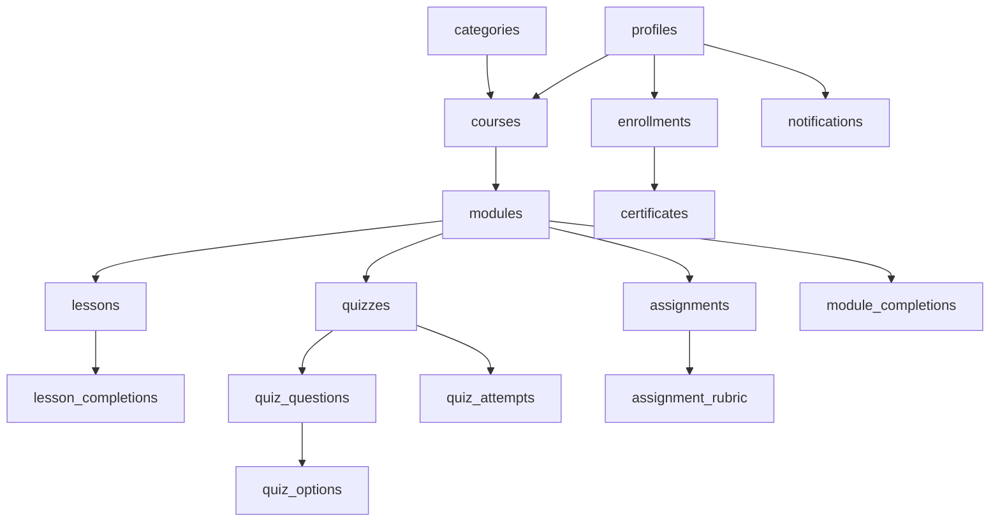

# Course Antik Database Documentation

## 📊 **Database Overview**

Course Antik is a comprehensive Learning Management System (LMS) with integrated e-commerce capabilities. The database architecture supports a complete educational platform with user management, course delivery, progress tracking, assessments, and product sales.

### **🏗️ System Architecture**

- **Total Tables**: 29 tables organized into 6 major functional systems
- **Database Type**: PostgreSQL with Supabase
- **Primary Keys**: UUID with automatic generation (`uuid_generate_v4()`)
- **Timestamps**: All tables use `timestamp with time zone` with `now()` defaults
- **Flexible Data**: JSONB fields for complex data structures

---

## 🔐 **User Management & Authentication System**

### **profiles**

**Purpose**: Core user information and role-based access control

| Column       | Type        | Nullable | Default   | Description                                 |
| ------------ | ----------- | -------- | --------- | ------------------------------------------- |
| `id`         | uuid        | NO       | -         | Primary key, references auth.users          |
| `full_name`  | text        | YES      | -         | User's display name                         |
| `avatar_url` | text        | YES      | -         | Profile picture URL                         |
| `bio`        | text        | YES      | -         | User biography/description                  |
| `role`       | text        | NO       | 'student' | User role: 'admin', 'instructor', 'student' |
| `created_at` | timestamptz | YES      | now()     | Account creation timestamp                  |
| `updated_at` | timestamptz | YES      | now()     | Last profile update                         |

**Key Features**:

- ✅ No UUID auto-generation (links to Supabase auth.users)
- ✅ Role-based access control
- ✅ Instructor and student differentiation

### **notifications**

**Purpose**: System-wide notification and communication management

| Column              | Type        | Nullable | Default            | Description                                 |
| ------------------- | ----------- | -------- | ------------------ | ------------------------------------------- |
| `id`                | uuid        | NO       | uuid_generate_v4() | Primary key                                 |
| `user_id`           | uuid        | YES      | -                  | Target user reference                       |
| `title`             | text        | NO       | -                  | Notification headline                       |
| `message`           | text        | NO       | -                  | Detailed message content                    |
| `notification_type` | text        | NO       | -                  | Category: 'enrollment', 'certificate', etc. |
| `is_read`           | boolean     | YES      | false              | Read status tracking                        |
| `action_url`        | text        | YES      | -                  | Deep link for notification action           |
| `metadata`          | jsonb       | YES      | -                  | Additional structured data                  |
| `created_at`        | timestamptz | YES      | now()              | Notification timestamp                      |

**Notification Types**:

- 📧 Course enrollment confirmations
- 🎓 Certificate issuance alerts
- 📝 Assignment grading notifications
- 💳 Payment confirmations
- 📢 System announcements

### **teacher_assignments**

**Purpose**: Multi-instructor course management with revenue sharing

| Column       | Type         | Nullable | Default            | Description               |
| ------------ | ------------ | -------- | ------------------ | ------------------------- |
| `id`         | uuid         | NO       | uuid_generate_v4() | Primary key               |
| `course_id`  | uuid         | YES      | -                  | Assigned course reference |
| `teacher_id` | uuid         | YES      | -                  | Instructor reference      |
| `percentage` | numeric(5,2) | NO       | -                  | Revenue share percentage  |
| `is_active`  | boolean      | YES      | true               | Assignment status         |
| `created_at` | timestamptz  | YES      | now()              | Assignment creation       |
| `updated_at` | timestamptz  | YES      | now()              | Last update               |

---

## 📚 **Course Curriculum System**

### **categories**

**Purpose**: Course organization and filtering system

| Column        | Type        | Nullable | Default            | Description             |
| ------------- | ----------- | -------- | ------------------ | ----------------------- |
| `id`          | uuid        | NO       | uuid_generate_v4() | Primary key             |
| `name`        | text        | NO       | -                  | Category display name   |
| `slug`        | text        | NO       | -                  | URL-friendly identifier |
| `description` | text        | YES      | -                  | Category description    |
| `image_url`   | text        | YES      | -                  | Category thumbnail      |
| `created_at`  | timestamptz | YES      | now()              | Creation timestamp      |

**Examples**: Web Development, Mobile Development, Data Science, UI/UX Design

### **courses**

**Purpose**: Main course information and metadata hub

| Column                 | Type         | Nullable | Default            | Description                            |
| ---------------------- | ------------ | -------- | ------------------ | -------------------------------------- |
| `id`                   | uuid         | NO       | uuid_generate_v4() | Primary key                            |
| `title`                | text         | NO       | -                  | Course name                            |
| `slug`                 | text         | NO       | -                  | URL identifier                         |
| `subtitle`             | text         | YES      | -                  | Short course description               |
| `description`          | text         | YES      | -                  | Detailed course overview               |
| `thumbnail`            | text         | YES      | -                  | Course cover image                     |
| `price_cents`          | integer      | NO       | 0                  | Price in cents (9900 = $99.00)         |
| `is_free`              | boolean      | NO       | false              | Free course flag                       |
| `is_featured`          | boolean      | NO       | false              | Homepage featured status               |
| `is_published`         | boolean      | NO       | false              | Public availability                    |
| `instructor_id`        | uuid         | YES      | -                  | Primary instructor reference           |
| `category_id`          | uuid         | YES      | -                  | Course category                        |
| `lessons_count`        | integer      | YES      | 0                  | Total lesson count                     |
| `modules_count`        | integer      | YES      | 0                  | Total module count                     |
| `estimated_duration`   | integer      | YES      | -                  | Course length in minutes               |
| `difficulty_level`     | text         | YES      | -                  | 'beginner', 'intermediate', 'advanced' |
| `includes_certificate` | boolean      | YES      | false              | Certificate eligibility                |
| `rating`               | numeric(3,2) | YES      | 0.0                | Average course rating (0.0-5.0)        |
| `enrolled_count`       | integer      | YES      | 0                  | Total student enrollments              |
| `created_at`           | timestamptz  | YES      | now()              | Course creation                        |
| `updated_at`           | timestamptz  | YES      | now()              | Last update                            |

**Business Logic**:

- 💰 Free courses: `price_cents = 0`, `is_free = true`
- ⭐ Featured courses: Displayed on homepage
- 📊 Rating: Calculated from course_reviews

### **modules**

**Purpose**: Sequential course structure and learning paths

| Column           | Type        | Nullable | Default            | Description                     |
| ---------------- | ----------- | -------- | ------------------ | ------------------------------- |
| `id`             | uuid        | NO       | uuid_generate_v4() | Primary key                     |
| `course_id`      | uuid        | YES      | -                  | Parent course reference         |
| `title`          | text        | NO       | -                  | Module name                     |
| `description`    | text        | YES      | -                  | Module overview                 |
| `module_order`   | integer     | NO       | -                  | Sequential ordering             |
| `estimated_time` | text        | YES      | -                  | Time to complete                |
| `pass_marks`     | integer     | NO       | 70                 | Minimum score to pass           |
| `is_required`    | boolean     | NO       | true               | Mandatory for course completion |
| `created_at`     | timestamptz | YES      | now()              | Module creation                 |
| `updated_at`     | timestamptz | YES      | now()              | Last update                     |

### **lessons**

**Purpose**: Individual learning content units with video support

| Column            | Type        | Nullable | Default            | Description                    |
| ----------------- | ----------- | -------- | ------------------ | ------------------------------ |
| `id`              | uuid        | NO       | uuid_generate_v4() | Primary key                    |
| `module_id`       | uuid        | YES      | -                  | Parent module reference        |
| `title`           | text        | NO       | -                  | Lesson name                    |
| `slug`            | text        | NO       | -                  | URL identifier                 |
| `description`     | text        | YES      | -                  | Lesson overview                |
| `lesson_order`    | integer     | NO       | -                  | Order within module            |
| `duration`        | integer     | NO       | 0                  | Video length in seconds        |
| `video_url`       | text        | YES      | -                  | Video content URL              |
| `video_type`      | text        | YES      | 'youtube'          | 'youtube', 'vimeo', 'direct'   |
| `is_free_preview` | boolean     | NO       | false              | Available without enrollment   |
| `content`         | jsonb       | YES      | -                  | Additional materials and notes |
| `created_at`      | timestamptz | YES      | now()              | Lesson creation                |
| `updated_at`      | timestamptz | YES      | now()              | Last update                    |

**Content Structure**:

```json
{
  "materials": ["React Documentation", "Setup Guide"],
  "notes": "Understanding React fundamentals"
}
```

### **quizzes**

**Purpose**: Module knowledge assessments and progress gates

| Column         | Type        | Nullable | Default            | Description                    |
| -------------- | ----------- | -------- | ------------------ | ------------------------------ |
| `id`           | uuid        | NO       | uuid_generate_v4() | Primary key                    |
| `module_id`    | uuid        | YES      | -                  | Parent module reference        |
| `title`        | text        | NO       | -                  | Quiz name                      |
| `description`  | text        | YES      | -                  | Quiz instructions              |
| `pass_marks`   | integer     | NO       | 70                 | Minimum score to pass          |
| `time_limit`   | integer     | YES      | -                  | Maximum time in seconds        |
| `is_required`  | boolean     | NO       | true               | Required for module completion |
| `max_attempts` | integer     | YES      | -                  | Maximum retry attempts         |
| `created_at`   | timestamptz | YES      | now()              | Quiz creation                  |
| `updated_at`   | timestamptz | YES      | now()              | Last update                    |

### **quiz_questions**

**Purpose**: Individual quiz questions with type support

| Column           | Type        | Nullable | Default            | Description                     |
| ---------------- | ----------- | -------- | ------------------ | ------------------------------- |
| `id`             | uuid        | NO       | uuid_generate_v4() | Primary key                     |
| `quiz_id`        | uuid        | YES      | -                  | Parent quiz reference           |
| `question`       | text        | NO       | -                  | Question text                   |
| `question_type`  | text        | NO       | -                  | 'single', 'multiple', 'boolean' |
| `question_order` | integer     | NO       | -                  | Order within quiz               |
| `explanation`    | text        | YES      | -                  | Answer explanation for learning |
| `created_at`     | timestamptz | YES      | now()              | Question creation               |

### **quiz_options**

**Purpose**: Multiple choice answer options

| Column         | Type        | Nullable | Default            | Description               |
| -------------- | ----------- | -------- | ------------------ | ------------------------- |
| `id`           | uuid        | NO       | uuid_generate_v4() | Primary key               |
| `question_id`  | uuid        | YES      | -                  | Parent question reference |
| `option_text`  | text        | NO       | -                  | Answer option text        |
| `option_order` | integer     | NO       | -                  | Display order             |
| `is_correct`   | boolean     | NO       | false              | Correct answer flag       |
| `created_at`   | timestamptz | YES      | now()              | Option creation           |

### **course_resources**

**Purpose**: Additional learning materials and downloads

| Column          | Type        | Nullable | Default            | Description                |
| --------------- | ----------- | -------- | ------------------ | -------------------------- |
| `id`            | uuid        | NO       | uuid_generate_v4() | Primary key                |
| `course_id`     | uuid        | YES      | -                  | Course reference           |
| `module_id`     | uuid        | YES      | -                  | Module reference           |
| `lesson_id`     | uuid        | YES      | -                  | Lesson reference           |
| `title`         | text        | NO       | -                  | Resource name              |
| `description`   | text        | YES      | -                  | Resource description       |
| `resource_type` | text        | NO       | -                  | 'file', 'link', 'document' |
| `url`           | text        | NO       | -                  | Resource URL or file path  |
| `file_size`     | integer     | YES      | -                  | File size in bytes         |
| `created_at`    | timestamptz | YES      | now()              | Resource creation          |

---

## 📈 **Student Progress & Learning System**

### **enrollments**

**Purpose**: Student course participation and progress tracking

| Column                | Type        | Nullable | Default            | Description                     |
| --------------------- | ----------- | -------- | ------------------ | ------------------------------- |
| `id`                  | uuid        | NO       | uuid_generate_v4() | Primary key                     |
| `course_id`           | uuid        | YES      | -                  | Enrolled course                 |
| `student_id`          | uuid        | YES      | -                  | Student profile reference       |
| `enrolled_at`         | timestamptz | YES      | now()              | Enrollment date                 |
| `completed_at`        | timestamptz | YES      | -                  | Course completion date          |
| `certificate_issued`  | boolean     | YES      | false              | Certificate generation status   |
| `progress_percentage` | integer     | YES      | 0                  | Overall course progress (0-100) |

### **lesson_completions**

**Purpose**: Individual lesson completion tracking with engagement metrics

| Column         | Type        | Nullable | Default            | Description                    |
| -------------- | ----------- | -------- | ------------------ | ------------------------------ |
| `id`           | uuid        | NO       | uuid_generate_v4() | Primary key                    |
| `lesson_id`    | uuid        | YES      | -                  | Completed lesson reference     |
| `student_id`   | uuid        | YES      | -                  | Student profile reference      |
| `completed_at` | timestamptz | YES      | now()              | Completion timestamp           |
| `watch_time`   | integer     | YES      | 0                  | Actual viewing time in seconds |

### **quiz_attempts**

**Purpose**: Quiz performance tracking and scoring

| Column         | Type        | Nullable | Default            | Description                |
| -------------- | ----------- | -------- | ------------------ | -------------------------- |
| `id`           | uuid        | NO       | uuid_generate_v4() | Primary key                |
| `quiz_id`      | uuid        | YES      | -                  | Attempted quiz reference   |
| `student_id`   | uuid        | YES      | -                  | Student profile reference  |
| `score`        | integer     | NO       | -                  | Achieved score (0-100)     |
| `passed`       | boolean     | NO       | -                  | Pass/fail status           |
| `time_spent`   | integer     | YES      | -                  | Time taken in seconds      |
| `answers`      | jsonb       | NO       | -                  | Student's selected answers |
| `completed_at` | timestamptz | YES      | now()              | Attempt completion time    |
| `created_at`   | timestamptz | YES      | now()              | Attempt start time         |

### **module_completions**

**Purpose**: Module-level progress with component tracking

| Column                  | Type        | Nullable | Default            | Description                |
| ----------------------- | ----------- | -------- | ------------------ | -------------------------- |
| `id`                    | uuid        | NO       | uuid_generate_v4() | Primary key                |
| `module_id`             | uuid        | YES      | -                  | Completed module reference |
| `student_id`            | uuid        | YES      | -                  | Student profile reference  |
| `completed_at`          | timestamptz | YES      | now()              | Module completion time     |
| `quiz_passed`           | boolean     | YES      | false              | Quiz requirement met       |
| `assignment_passed`     | boolean     | YES      | false              | Assignment requirement met |
| `all_lessons_completed` | boolean     | YES      | false              | All lessons viewed         |

**Completion Logic**: All three conditions must be `true` for module completion.

### **module_prerequisites**

**Purpose**: Learning path dependencies and sequencing

| Column                   | Type        | Nullable | Default            | Description                  |
| ------------------------ | ----------- | -------- | ------------------ | ---------------------------- |
| `id`                     | uuid        | NO       | uuid_generate_v4() | Primary key                  |
| `module_id`              | uuid        | YES      | -                  | Target module                |
| `prerequisite_module_id` | uuid        | YES      | -                  | Required prerequisite module |
| `created_at`             | timestamptz | YES      | now()              | Prerequisite creation        |

### **certificates**

**Purpose**: Course completion recognition and verification

| Column               | Type        | Nullable | Default            | Description                   |
| -------------------- | ----------- | -------- | ------------------ | ----------------------------- |
| `id`                 | uuid        | NO       | uuid_generate_v4() | Primary key                   |
| `course_id`          | uuid        | YES      | -                  | Completed course reference    |
| `student_id`         | uuid        | YES      | -                  | Certificate recipient         |
| `certificate_number` | text        | NO       | -                  | Unique certificate identifier |
| `issued_at`          | timestamptz | YES      | now()              | Certificate generation time   |
| `certificate_url`    | text        | YES      | -                  | PDF certificate download link |
| `verification_url`   | text        | YES      | -                  | Public verification link      |
| `is_valid`           | boolean     | YES      | true               | Certificate validity status   |
| `created_at`         | timestamptz | YES      | now()              | Record creation               |

---

## 📝 **Assignment & Assessment System**

### **assignments**

**Purpose**: Project-based assessments with file submission support

| Column               | Type        | Nullable | Default            | Description                    |
| -------------------- | ----------- | -------- | ------------------ | ------------------------------ |
| `id`                 | uuid        | NO       | uuid_generate_v4() | Primary key                    |
| `module_id`          | uuid        | YES      | -                  | Parent module reference        |
| `title`              | text        | NO       | -                  | Assignment name                |
| `description`        | text        | NO       | -                  | Assignment instructions        |
| `requirements`       | jsonb       | NO       | -                  | Structured requirements list   |
| `submission_type`    | text        | NO       | -                  | 'file', 'text', 'url'          |
| `allowed_file_types` | jsonb       | YES      | -                  | Permitted file extensions      |
| `max_file_size`      | integer     | YES      | -                  | Upload size limit in bytes     |
| `pass_marks`         | integer     | NO       | 70                 | Minimum score to pass          |
| `is_required`        | boolean     | NO       | true               | Required for module completion |
| `due_date`           | timestamptz | YES      | -                  | Submission deadline            |
| `created_at`         | timestamptz | YES      | now()              | Assignment creation            |
| `updated_at`         | timestamptz | YES      | now()              | Last update                    |

**Requirements Structure**:

```json
[
  "Create a counter component",
  "Implement increment/decrement functionality",
  "Style with CSS",
  "Add prop validation"
]
```

### **assignment_submissions**

**Purpose**: Student project submissions with grading workflow

| Column            | Type        | Nullable | Default            | Description                      |
| ----------------- | ----------- | -------- | ------------------ | -------------------------------- |
| `id`              | uuid        | NO       | uuid_generate_v4() | Primary key                      |
| `assignment_id`   | uuid        | YES      | -                  | Target assignment reference      |
| `student_id`      | uuid        | YES      | -                  | Submitting student               |
| `submission_type` | text        | NO       | -                  | Type of submission               |
| `content`         | text        | YES      | -                  | Text content or submission notes |
| `files`           | jsonb       | YES      | -                  | Uploaded file information        |
| `status`          | text        | NO       | 'pending'          | 'pending', 'graded', 'returned'  |
| `score`           | integer     | YES      | -                  | Assigned grade (0-100)           |
| `passed`          | boolean     | YES      | -                  | Pass/fail based on pass_marks    |
| `feedback`        | text        | YES      | -                  | Instructor feedback              |
| `graded_at`       | timestamptz | YES      | -                  | Grading completion time          |
| `graded_by`       | uuid        | YES      | -                  | Grading instructor reference     |
| `submitted_at`    | timestamptz | YES      | now()              | Original submission time         |
| `created_at`      | timestamptz | YES      | now()              | Record creation                  |

### **assignment_rubric**

**Purpose**: Structured grading criteria for consistent evaluation

| Column          | Type        | Nullable | Default            | Description                    |
| --------------- | ----------- | -------- | ------------------ | ------------------------------ |
| `id`            | uuid        | NO       | uuid_generate_v4() | Primary key                    |
| `assignment_id` | uuid        | YES      | -                  | Target assignment reference    |
| `criteria`      | text        | NO       | -                  | Grading criterion name         |
| `description`   | text        | YES      | -                  | Detailed criterion description |
| `points`        | integer     | NO       | -                  | Maximum points for criterion   |
| `rubric_order`  | integer     | NO       | -                  | Display order                  |
| `created_at`    | timestamptz | YES      | now()              | Rubric creation                |

### **assignment_rubric_scores**

**Purpose**: Individual criterion scoring for detailed feedback

| Column           | Type        | Nullable | Default            | Description                  |
| ---------------- | ----------- | -------- | ------------------ | ---------------------------- |
| `id`             | uuid        | NO       | uuid_generate_v4() | Primary key                  |
| `submission_id`  | uuid        | YES      | -                  | Target submission reference  |
| `rubric_item_id` | uuid        | YES      | -                  | Scored criterion reference   |
| `score`          | integer     | NO       | -                  | Points awarded for criterion |
| `created_at`     | timestamptz | YES      | now()              | Score creation               |

---

## 🛒 **E-commerce & Shop System**

### **product_categories**

**Purpose**: Product organization and browsing structure

| Column        | Type        | Nullable | Default            | Description          |
| ------------- | ----------- | -------- | ------------------ | -------------------- |
| `id`          | uuid        | NO       | uuid_generate_v4() | Primary key          |
| `name`        | text        | NO       | -                  | Category name        |
| `slug`        | text        | NO       | -                  | URL identifier       |
| `description` | text        | YES      | -                  | Category description |
| `image_url`   | text        | YES      | -                  | Category thumbnail   |
| `created_at`  | timestamptz | YES      | now()              | Category creation    |

### **products**

**Purpose**: Physical and digital products with variant support

| Column              | Type         | Nullable | Default            | Description                  |
| ------------------- | ------------ | -------- | ------------------ | ---------------------------- |
| `id`                | uuid         | NO       | uuid_generate_v4() | Primary key                  |
| `title`             | text         | NO       | -                  | Product name                 |
| `slug`              | text         | NO       | -                  | URL identifier               |
| `description`       | text         | YES      | -                  | Detailed product description |
| `short_description` | text         | YES      | -                  | Brief product summary        |
| `price_cents`       | integer      | NO       | -                  | Regular price in cents       |
| `sale_price_cents`  | integer      | YES      | -                  | Discounted price in cents    |
| `category_id`       | uuid         | YES      | -                  | Product category reference   |
| `stock_quantity`    | integer      | YES      | 0                  | Available inventory          |
| `is_active`         | boolean      | YES      | true               | Product availability         |
| `is_featured`       | boolean      | YES      | false              | Homepage featured status     |
| `rating`            | numeric(3,2) | YES      | 0.0                | Average customer rating      |
| `reviews_count`     | integer      | YES      | 0                  | Total review count           |
| `images`            | jsonb        | YES      | -                  | Product image URLs array     |
| `features`          | jsonb        | YES      | -                  | Key product features list    |
| `specifications`    | jsonb        | YES      | -                  | Technical specifications     |
| `sizes`             | jsonb        | YES      | -                  | Available sizes array        |
| `colors`            | jsonb        | YES      | -                  | Available colors array       |
| `created_at`        | timestamptz  | YES      | now()              | Product creation             |
| `updated_at`        | timestamptz  | YES      | now()              | Last update                  |

### **cart_items**

**Purpose**: Shopping cart management with variant selection

| Column             | Type        | Nullable | Default            | Description                         |
| ------------------ | ----------- | -------- | ------------------ | ----------------------------------- |
| `id`               | uuid        | NO       | uuid_generate_v4() | Primary key                         |
| `user_id`          | uuid        | YES      | -                  | Cart owner                          |
| `course_id`        | uuid        | YES      | -                  | Course in cart (if applicable)      |
| `product_id`       | uuid        | YES      | -                  | Product in cart (if applicable)     |
| `quantity`         | integer     | YES      | 1                  | Item quantity                       |
| `selected_options` | jsonb       | YES      | -                  | Chosen variants (size, color, etc.) |
| `added_at`         | timestamptz | YES      | now()              | Cart addition time                  |

### **orders**

**Purpose**: Purchase transaction management with address storage

| Column             | Type        | Nullable | Default            | Description                                     |
| ------------------ | ----------- | -------- | ------------------ | ----------------------------------------------- |
| `id`               | uuid        | NO       | uuid_generate_v4() | Primary key                                     |
| `user_id`          | uuid        | YES      | -                  | Purchasing customer                             |
| `order_number`     | text        | NO       | -                  | Unique order identifier                         |
| `status`           | text        | NO       | 'pending'          | 'pending', 'completed', 'cancelled', 'refunded' |
| `total_amount`     | integer     | NO       | -                  | Total price in cents                            |
| `currency`         | text        | YES      | 'BDT'              | Currency code                                   |
| `payment_method`   | text        | YES      | -                  | 'bkash', 'nagad', 'rocket', 'card'              |
| `payment_status`   | text        | YES      | 'pending'          | 'pending', 'paid', 'failed'                     |
| `payment_id`       | text        | YES      | -                  | Payment gateway transaction ID                  |
| `shipping_address` | jsonb       | YES      | -                  | Delivery address information                    |
| `billing_address`  | jsonb       | YES      | -                  | Billing address information                     |
| `notes`            | text        | YES      | -                  | Special instructions                            |
| `created_at`       | timestamptz | YES      | now()              | Order creation                                  |
| `updated_at`       | timestamptz | YES      | now()              | Last update                                     |

### **order_items**

**Purpose**: Individual order line items with variant tracking

| Column             | Type        | Nullable | Default            | Description                       |
| ------------------ | ----------- | -------- | ------------------ | --------------------------------- |
| `id`               | uuid        | NO       | uuid_generate_v4() | Primary key                       |
| `order_id`         | uuid        | YES      | -                  | Parent order reference            |
| `course_id`        | uuid        | YES      | -                  | Purchased course (if applicable)  |
| `product_id`       | uuid        | YES      | -                  | Purchased product (if applicable) |
| `item_type`        | text        | NO       | -                  | 'course' or 'product'             |
| `title`            | text        | NO       | -                  | Item name at time of purchase     |
| `price_cents`      | integer     | NO       | -                  | Item price at time of purchase    |
| `quantity`         | integer     | YES      | 1                  | Number of items                   |
| `selected_options` | jsonb       | YES      | -                  | Chosen variants                   |
| `created_at`       | timestamptz | YES      | now()              | Order item creation               |

### **course_reviews**

**Purpose**: Student course feedback with moderation

| Column        | Type        | Nullable | Default            | Description       |
| ------------- | ----------- | -------- | ------------------ | ----------------- |
| `id`          | uuid        | NO       | uuid_generate_v4() | Primary key       |
| `course_id`   | uuid        | YES      | -                  | Reviewed course   |
| `student_id`  | uuid        | YES      | -                  | Review author     |
| `rating`      | integer     | NO       | -                  | Star rating (1-5) |
| `comment`     | text        | YES      | -                  | Written review    |
| `is_approved` | boolean     | YES      | false              | Moderation status |
| `created_at`  | timestamptz | YES      | now()              | Review creation   |
| `updated_at`  | timestamptz | YES      | now()              | Last update       |

### **product_reviews**

**Purpose**: Customer product feedback with moderation

| Column        | Type        | Nullable | Default            | Description       |
| ------------- | ----------- | -------- | ------------------ | ----------------- |
| `id`          | uuid        | NO       | uuid_generate_v4() | Primary key       |
| `product_id`  | uuid        | YES      | -                  | Reviewed product  |
| `user_id`     | uuid        | YES      | -                  | Review author     |
| `rating`      | integer     | NO       | -                  | Star rating (1-5) |
| `comment`     | text        | YES      | -                  | Written review    |
| `is_approved` | boolean     | YES      | false              | Moderation status |
| `created_at`  | timestamptz | YES      | now()              | Review creation   |
| `updated_at`  | timestamptz | YES      | now()              | Last update       |

### **teacher_earnings**

**Purpose**: Instructor revenue tracking with commission management

| Column            | Type         | Nullable | Default            | Description                           |
| ----------------- | ------------ | -------- | ------------------ | ------------------------------------- |
| `id`              | uuid         | NO       | uuid_generate_v4() | Primary key                           |
| `instructor_id`   | uuid         | YES      | -                  | Earning instructor                    |
| `course_id`       | uuid         | YES      | -                  | Revenue source course                 |
| `order_id`        | uuid         | YES      | -                  | Originating order                     |
| `amount_cents`    | integer      | NO       | -                  | Earned amount in cents                |
| `commission_rate` | numeric(5,2) | NO       | -                  | Percentage rate (e.g., 80.00 for 80%) |
| `status`          | text         | NO       | 'pending'          | 'pending', 'paid', 'hold'             |
| `paid_at`         | timestamptz  | YES      | -                  | Payment completion time               |
| `created_at`      | timestamptz  | YES      | now()              | Earning record creation               |

---

## 🎯 **Assessment & Recommendation System**

### **course_assessments**

**Purpose**: Pre-course skill evaluation and personalization

| Column        | Type        | Nullable | Default            | Description                      |
| ------------- | ----------- | -------- | ------------------ | -------------------------------- |
| `id`          | uuid        | NO       | uuid_generate_v4() | Primary key                      |
| `course_id`   | uuid        | YES      | -                  | Target course                    |
| `title`       | text        | NO       | -                  | Assessment name                  |
| `description` | text        | YES      | -                  | Assessment instructions          |
| `questions`   | jsonb       | NO       | -                  | Assessment questions array       |
| `results`     | jsonb       | NO       | -                  | Scoring and recommendation logic |
| `created_at`  | timestamptz | YES      | now()              | Assessment creation              |
| `updated_at`  | timestamptz | YES      | now()              | Last update                      |

### **assessment_attempts**

**Purpose**: Student assessment results with personalized recommendations

| Column            | Type        | Nullable | Default            | Description                  |
| ----------------- | ----------- | -------- | ------------------ | ---------------------------- |
| `id`              | uuid        | NO       | uuid_generate_v4() | Primary key                  |
| `assessment_id`   | uuid        | YES      | -                  | Completed assessment         |
| `user_id`         | uuid        | YES      | -                  | Student taking assessment    |
| `answers`         | jsonb       | NO       | -                  | Student's responses          |
| `score`           | integer     | NO       | -                  | Calculated score             |
| `result_category` | text        | NO       | -                  | Skill level classification   |
| `recommendations` | jsonb       | YES      | -                  | Personalized recommendations |
| `completed_at`    | timestamptz | YES      | now()              | Assessment completion time   |
| `created_at`      | timestamptz | YES      | now()              | Record creation              |

---

## 🔗 **Database Relationships**

### **Primary Relationships**



### **Key Foreign Key Relationships**

| Child Table   | Parent Table | Foreign Key   | Description         |
| ------------- | ------------ | ------------- | ------------------- |
| courses       | profiles     | instructor_id | Course instructor   |
| courses       | categories   | category_id   | Course category     |
| modules       | courses      | course_id     | Module's course     |
| lessons       | modules      | module_id     | Lesson's module     |
| quizzes       | modules      | module_id     | Quiz's module       |
| assignments   | modules      | module_id     | Assignment's module |
| enrollments   | courses      | course_id     | Enrolled course     |
| enrollments   | profiles     | student_id    | Enrolled student    |
| quiz_attempts | quizzes      | quiz_id       | Attempted quiz      |
| quiz_attempts | profiles     | student_id    | Student attempt     |

---

## ⚡ **Performance & Optimization**

### **Indexing Strategy**

- ✅ **Primary Keys**: UUID fields automatically indexed
- ✅ **Foreign Keys**: All reference fields indexed for join performance
- ✅ **Slug Fields**: Indexed for URL lookups (`courses.slug`, `lessons.slug`)
- ✅ **Status Fields**: Indexed for filtering (`is_published`, `is_active`)
- ✅ **Timestamps**: Indexed for sorting and time-based queries

### **Query Optimization**

- 🔍 **Course Listings**: Include instructor and category joins
- 📊 **Student Progress**: Aggregate queries with proper indexes
- 🛒 **E-commerce**: Product searches with category filters
- 📈 **Analytics**: Time-based queries with date indexes

### **Scaling Considerations**

- 📦 **JSONB Fields**: Flexible schema evolution
- 📄 **Pagination**: Large result sets handled efficiently
- 🔄 **Database Triggers**: Automatic calculations (progress, ratings)
- 📖 **Read Replicas**: Analytics queries separated from main database
- 🌐 **CDN**: Static assets (images, videos) served from CDN

---

## 🔒 **Security & Permissions**

### **Row Level Security (RLS)**

- 👥 **Students**: Can only access their own progress data
- 👨‍🏫 **Instructors**: Can only manage their own courses
- 👑 **Admins**: Full access to all data
- 🌍 **Public**: Access to published courses and products

### **Data Privacy**

- 🔐 **Encryption**: Personal information encrypted at rest
- 💳 **Payment Security**: Payment data handled by secure gateways
- ✅ **Consent Tracking**: User consent for communications
- 🇪🇺 **GDPR Compliance**: Data deletion capabilities

### **Access Control**

- 🎭 **Role-based Permissions**: admin, instructor, student roles
- 🔑 **API Authentication**: Supabase Auth integration
- 🎫 **Session Management**: Token validation and refresh
- 🚦 **Rate Limiting**: API endpoint protection

---

## 📊 **Analytics & Reporting**

### **Course Analytics**

- 📈 Enrollment trends and completion rates
- ⏱️ Student engagement metrics (watch time, quiz scores)
- 🏆 Popular courses and categories
- 👨‍🏫 Instructor performance metrics

### **Business Analytics**

- 💰 Revenue tracking and commission calculations
- 📦 Product sales and inventory management
- 👥 Customer lifetime value analysis
- 🔄 Conversion funnel optimization

### **Student Analytics**

- 📚 Learning progress and achievement tracking
- 🎯 Skill assessment and gap analysis
- 🔮 Personalized course recommendations
- 🏅 Certificate and achievement portfolio

---

## 🔧 **Integration Points**

### **External Services**

- 🔐 **Supabase Auth**: User authentication and management
- 💳 **Payment Gateways**: bKash, Nagad, Rocket, SSL Commerz
- 🎥 **Video Hosting**: YouTube, Vimeo, direct uploads
- 📧 **Email Service**: Transactional emails and notifications
- 📁 **File Storage**: Supabase Storage for assignments and resources

### **API Endpoints**

- 🌐 **RESTful API**: All CRUD operations
- ⚡ **Real-time Subscriptions**: Live progress updates
- 🪝 **Webhooks**: Payment confirmation endpoints
- 📊 **GraphQL**: Complex query support
- 📱 **Mobile API**: Mobile app compatibility

---

## 🚀 **Future Enhancements**

### **Planned Features**

- 💬 Discussion forums and community features
- 📡 Live streaming and webinar capabilities
- 📊 Advanced analytics and reporting dashboard
- 📱 Mobile app with offline content support
- 🔗 Integration with third-party learning tools
- ⛓️ Blockchain-based certificate verification
- 🤖 AI-powered content recommendations
- 🌍 Multi-language support and localization

---

## 📝 **Database Summary**

| **Metric**            | **Value**         | **Description**                |
| --------------------- | ----------------- | ------------------------------ |
| **Total Tables**      | 29                | Complete database structure    |
| **System Categories** | 6                 | Major functional areas         |
| **User Roles**        | 3                 | admin, instructor, student     |
| **Primary Key Type**  | UUID              | Universally unique identifiers |
| **Timestamp Type**    | timestamptz       | Timezone-aware timestamps      |
| **Flexible Data**     | JSONB             | Complex data structures        |
| **File Storage**      | Supabase          | Integrated file management     |
| **Authentication**    | Supabase Auth     | Built-in user management       |
| **Real-time**         | Supabase Realtime | Live data updates              |

---

**📚 Course Antik Database - Complete Backend Architecture Documentation**

_This documentation provides a comprehensive overview of the Course Antik database structure, relationships, and integration points for development, maintenance, and scaling._
